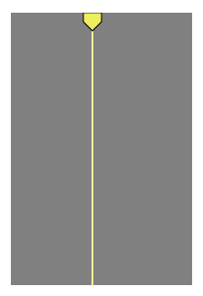

# svg-playhead

Render a playhead element as svg.



## Usage

```js
const Playhead = require('svg-playhead')
const html = require('bel')

const playhead = new Playhead

const el = html`
  <svg heigth=600 width=100>
    <rect height=100% width=100% fill=gray />
    <g transform="translate(40, 0)">
      ${playhead.render({ height: 600, width: 10 })}
    </g>
  </svg>
`

document.body.appendChild(el)
```

## License

MIT
